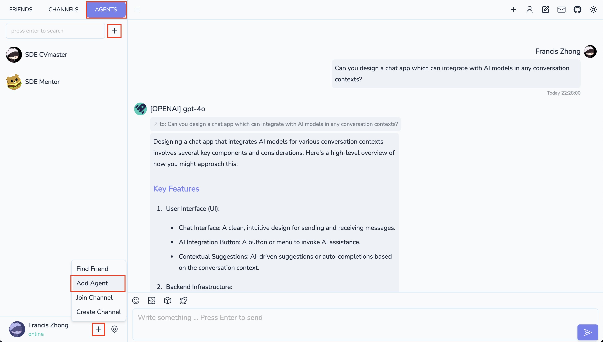
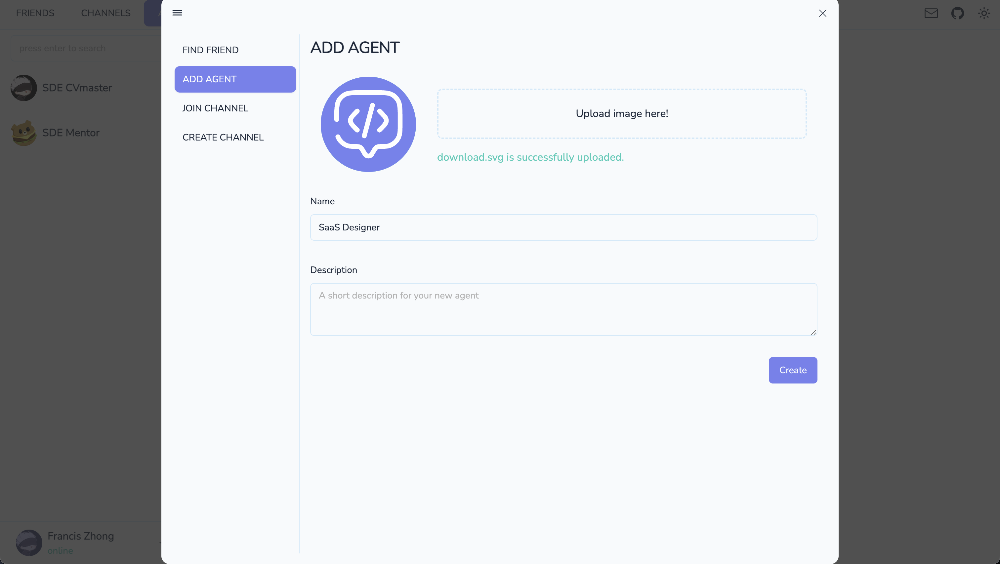
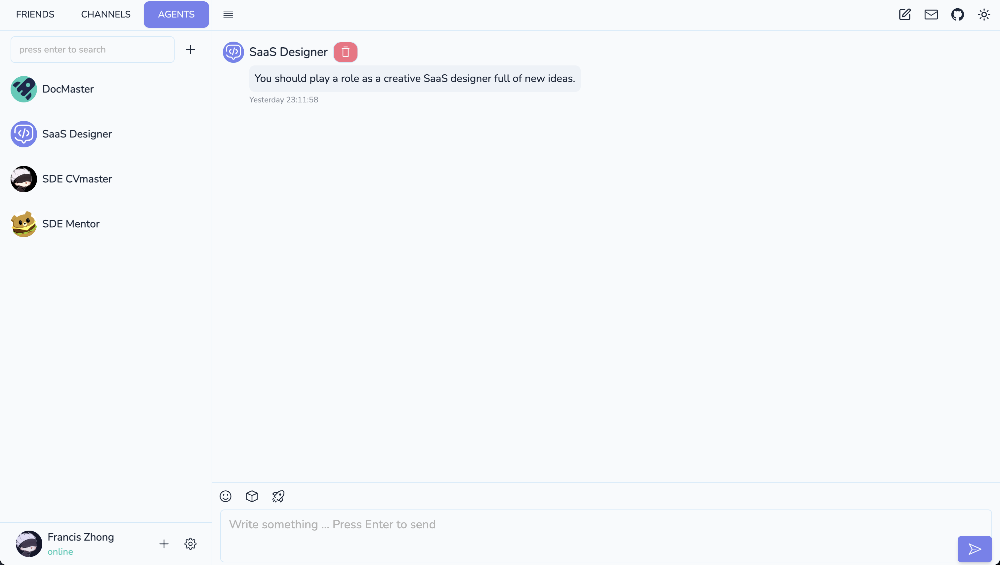
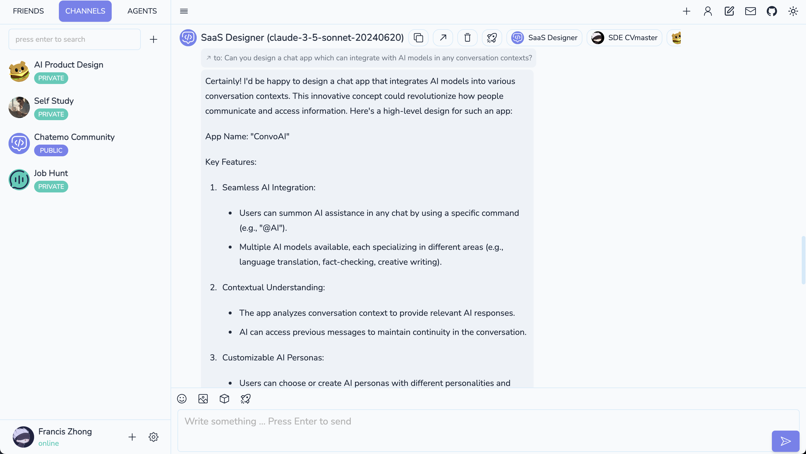
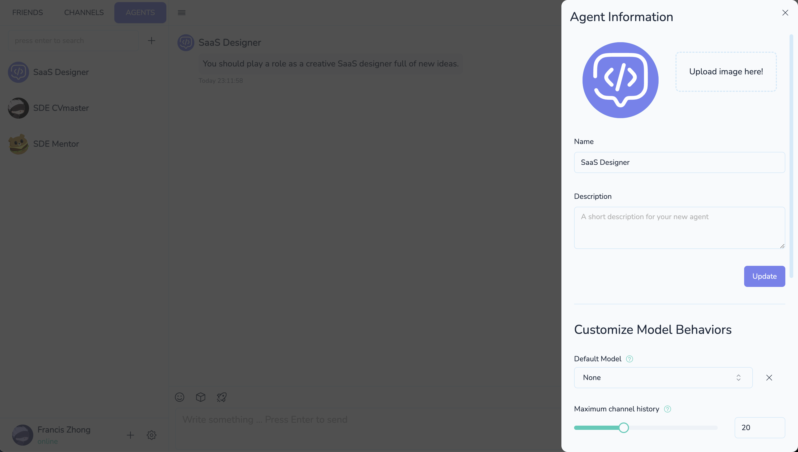
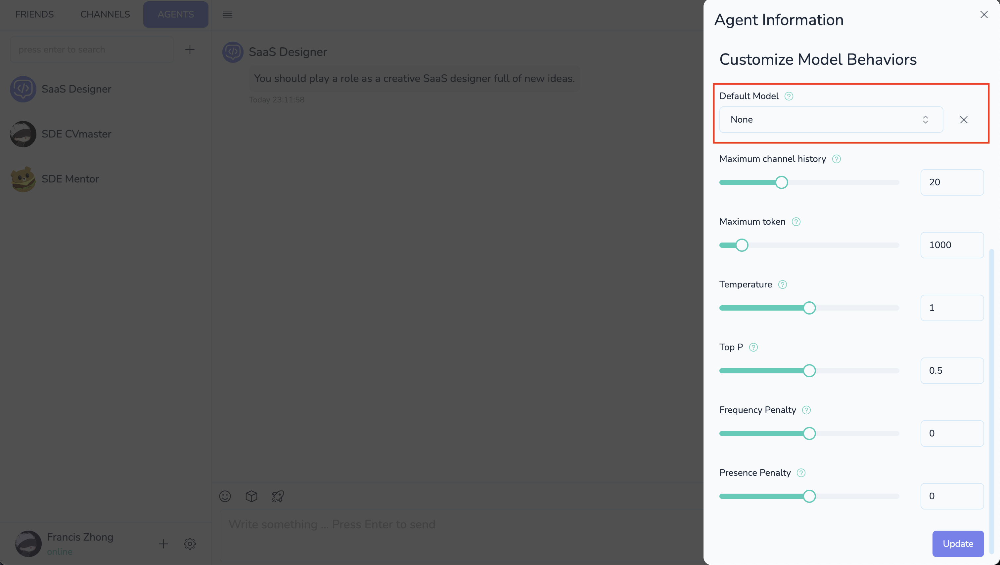
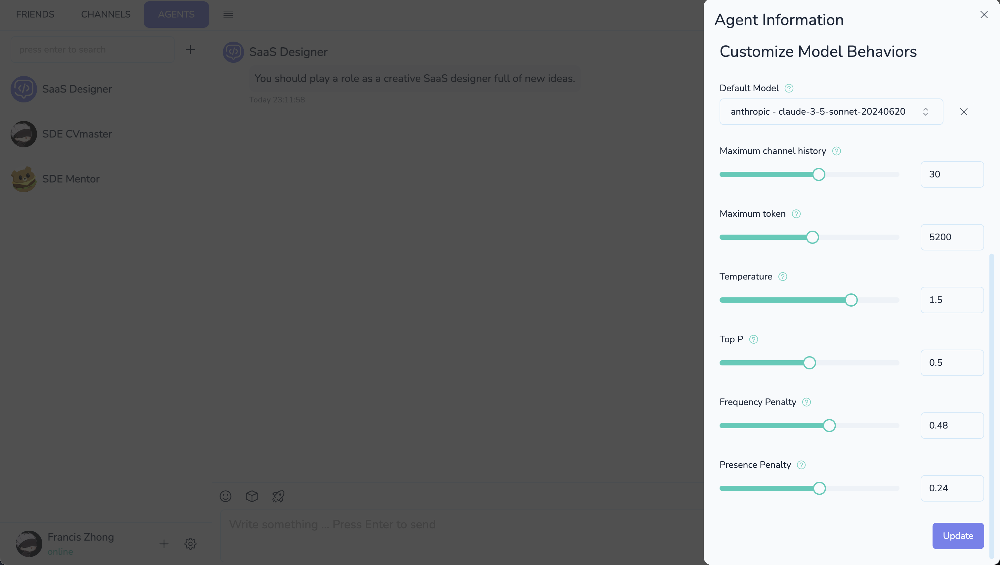
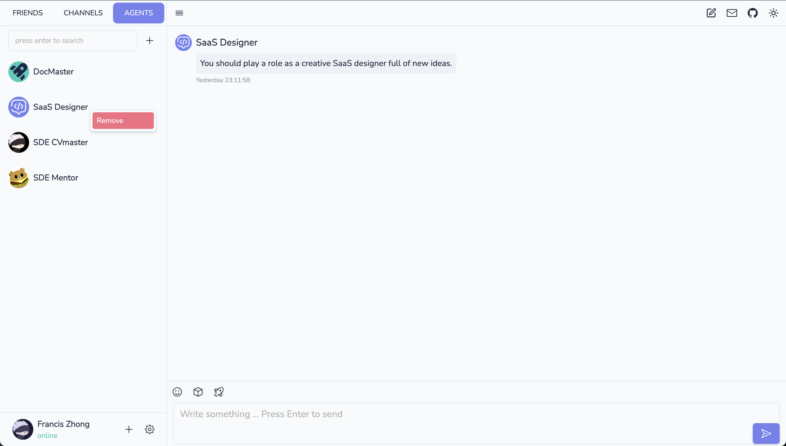

# Create a new Agent in 1 Minute

In Chatemo, agent is the reusable robot to memorize your system prompts and preferable model behaviours. For example, you can define an agent called "Markdown Master" and request it to respond everything in Markdown format and polish your writing based on a customized styles. To achieve this purpose, Chatemo provides prompts, default model options and some configurable parameters to fine tune model behaviours.

## Name your agent

Let's create your first agent.

1. Click the agent tab in the sidebar to view the agent list.

2. To create a new agent:
   - Click the plus button in the sidebar, or
   - Click the plus button near your avatar at the bottom.

3. Give the name for your agent, and briefly introduce about it. Also, you can upload an Avatar image for it, otherwise chatemo will use the default avatar.

4. Click create and then your agent is ready to use.

## Give a prompt

Sysmem prompt is the most useful approach to customize agent behaviour. You can type some requests to modify the agent behaviours. These prompts will be used to all LLMs if you make an agent call. For example, you can type "You should play a role as a creative SaaS designer full of new ideas" to make this agent focus on SaaS design.

Then this agent is available for all the channels you have joined. You can use them by hover the message to request and click the agent button.

You can give multiple prompts for a single agent and make modifications whenever you want. If some prompts don't work well, just hover that prompt and click the trash-icon button to remove that prompt. Besides, we recommond to combine some prompts if there are too many.

## Configuration

### Edit agent information

If you want to update the meta information, just click the edit-icon button on the right top of chat window. The agent information editter should be shown like the follows:

### Default Model

Agent is not bound to any LLM as default, so you can switch the preferable models in different conversation contexts (agent preview mode, channels or direct messages with friends). This feature enable you try any combinations of agent and model for a single requests and get the better results from comparable options.

If you don't bind the best-match model for your specific task, we recommend not to specify the default model for your agent. If the agent default is set, Chatemo will use that model instead of the model chosen in channels and friend conversations. Besides, whenever you can remove the default model, just click the cross button near the default model selector.

### Model Parameters

The model parameters are used for LLMs api calls to influence their behaviours. In Chatemo, most variables work well in all models. There are some parameters might not used if the LLM provider does not support them. In this case, Chatemo server will ignore these prameters, so feel free to try different models. You can edit these model configuration by scolling down the agent information form.

The default values for these model variables are those values in user default model configuration snapshot at the moment you create the agent. Hence, if you change the default model behavior will not synchronize these changes to your model. For what these variables stand for, you can hover the question icon or check .

## Preview Mode

TODO

## Delete Agent

If you plan to delete an agent, just right click or double click (Mac) on the agent in the sidebar. Then remove the agent as follows:

